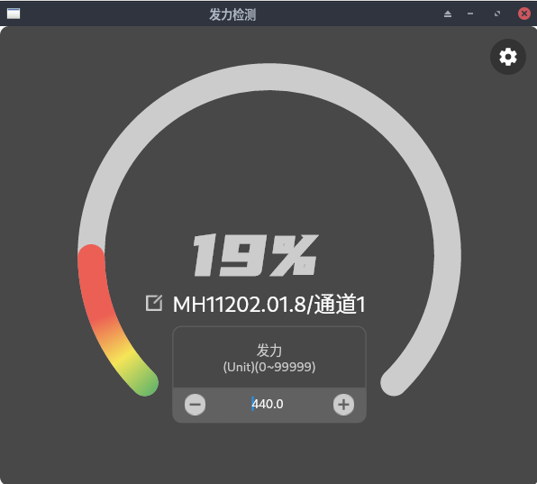

| 版本号  | 修订内容                                                                   | 修改时间       | 作者         |
|------|------------------------------------------------------------------------|------------|------------|
| V1.0 | 创建文档                                                                   |            | 李易哲、鲍志刚、尹霖 |
| V1.1 | 1) socket数据->接收数据->1.采集数据：新增包序号及丢包率字段<br/>2) socket数据->数据分析->1.发力检测：修改 | 2023-08-21 | 李易哲、尹霖     |
| V1.2 | 增加状态信息、分析结果、算法                                                         | 2024-08-09 | 李易哲     |
| V1.3 | 增加发送数据对应的响应结果                                                          | 2024-08-13 | 李易哲     |


# 插件`epstudio_sdk_flutter_module`集成方式

## 1 安卓端

### 1.1 原生集成

将`Flutter module`集成到`Android`项目官方文档[链接](https://flutter.cn/docs/add-to-app/android/project-setup)

#### 1.1.1 准备aar包
```text
准备构建好的aar包，本项目为repo.tar.gz,解压获取文件夹全路径 /xxx/xxx/repo
```

#### 1.1.2 配置仓库
```groovy
// settings.gradle文件，添加仓库
String storageUrl = System.env.FLUTTER_STORAGE_BASE_URL ?: "https://storage.googleapis.com"
repositories {
    maven {
        url '/xxx/xxx/repo'
    }
    maven {
        url "$storageUrl/download.flutter.io"
    }
}
```

#### 1.1.3 添加依赖
```groovy
// build.gradle文件，添加依赖和profile
dependencies {
    // websocket的依赖
    implementation 'org.java-websocket:Java-WebSocket:1.5.3'
    // 本项目的依赖
    debugImplementation 'com.neuramatrix.epstudio_sdk_flutter_module:flutter_debug:1.0'
    profileImplementation 'com.neuramatrix.epstudio_sdk_flutter_module:flutter_profile:1.0'
    releaseImplementation 'com.neuramatrix.epstudio_sdk_flutter_module:flutter_release:1.0'
}

android {
    buildTypes {
        profile {
            initWith debug
        }
    }
}
```

#### 1.1.4 授权
```xml
<!-- AndroidManifest.xml，添加FlutterActivity和授权(蓝牙、位置信息) -->
<manifest>
    <!-- 位置 -->
    <uses-permission android:name="android.permission.ACCESS_COARSE_LOCATION"/>
    <!-- 蓝牙 -->
    <uses-permission android:name="android.permission.BLUETOOTH"/>
    <uses-permission android:name="android.permission.BLUETOOTH_ADMIN"/>
    <uses-permission android:name="android.permission.BLUETOOTH_SCAN"/>
    <uses-permission android:name="android.permission.BLUETOOTH_CONNECT"/>
    <uses-permission android:name="android.permission.BLUETOOTH_ADVERTISE"/>
    <uses-permission android:name="android.permission.BLUETOOTH_PRIVILEGED" tools:ignore="ProtectedPermissions"/>

    <!-- 引入Flutter -->
    <activity
            android:name="io.flutter.embedding.android.FlutterActivity"
            android:configChanges="orientation|keyboardHidden|keyboard|screenSize|locale|layoutDirection|fontScale|screenLayout|density|uiMode"
            android:hardwareAccelerated="true"
            android:theme="@style/Theme.ExampleAndroid"
            android:windowSoftInputMode="adjustResize"
    />
</manifest>
```

#### 1.1.5 启动方式引入
```kotlin
/**
 * 项目启动入口启动FlutterEngine。其中socketPort为flutter插件中启动的SocketServer端口，默认为3000。
 */
// 创建FlutterEngin
// Instantiate a FlutterEngine.
val flutterEngine = FlutterEngine(this)
// Start executing Dart code to pre-warm the FlutterEngine.
flutterEngine.dartExecutor.executeDartEntrypoint(
    DartExecutor.DartEntrypoint.createDefault(), 
    listOf("socketPort=3000")
)
// Cache the FlutterEngine to be used by FlutterActivity.
FlutterEngineCache.getInstance().put("epstudio_sdk_flutter", flutterEngine)

// 申请蓝牙相关权限
requestMultiplePermissions.launch(arrayOf(
    android.Manifest.permission.ACCESS_FINE_LOCATION,
    android.Manifest.permission.BLUETOOTH_SCAN,
    android.Manifest.permission.BLUETOOTH_CONNECT
))
```

#### 1.1.6 Socket客户端
```kotlin

typealias ReceiveListener = ((str: String)->Unit)
// socket 客户端工具类
object WebSocketUtil {
    var webSocketClient : WebSocketClient
    var listenerMap = mutableMapOf<String, ReceiveListener>()
    const val port = 3000
    init {
        // url地址
        val  serverURI = URI.create("ws://127.0.0.1:$port/socket.io/?transport=websocket")
        webSocketClient = object: WebSocketClient(serverURI){
            override fun onOpen(handshakedata: ServerHandshake?) {
                Log.i( "onOpen", "WebSocket已连接=============================")
                onMsg("onOpen WebSocket已连接=============================")
            }

            override fun onWebsocketPong(conn: WebSocket?, f: Framedata?) {
                Log.i("onWebsocketPong", "链接：$conn 收到：$f")
                conn?.send("30")
            }

            override fun onMessage(message: String?) {
                message?.let {
                    if (it.startsWith("42")){
                        val res = JSONArray(it.substring(2))
                        if (res[0].equals("data")){
                            onData(res[1].toString())
                        }else{
                            onMsg(res[1].toString())
                        }
                    }else{
                        Log.i("onMessage", "收到服务器消息：$message")
                    }
                }
            }

            override fun onClose(code: Int, reason: String?, remote: Boolean) {
                Log.i("onClose",  "WebSocket已关闭")
                onMsg("onClose WebSocket已关闭")
            }

            override fun onError(ex: Exception?) {
                Log.i("onError", "服务器状态：${ex?.toString()}")
                onMsg("onError 服务器状态：${ex?.toString()}")
            }
        }
    }
    fun onMsg(msg: String?){
        listenerMap["msg"]?.invoke(msg?:"null")
    }
    fun onData(data: String?){
        listenerMap["data"]?.invoke(data?:"null")
    }
}

// 接收msg类型数据
WebSocketUtil.listenerMap["msg"] = { str:String->
    println(str)
}

// 接收data类型数据
WebSocketUtil.listenerMap["data"] = { str:String->
    println(str)
}

var socketClient: WebSocketClient = WebSocketUtil.webSocketClient

// 建立链接
socketClient.connect()

// 开始扫描
val params = JSONArray()
params.put("startScan")
val a = "42${params}"
socketClient.send(a)

// 停止扫描
val params = JSONArray()
params.put("stopScan")
val a = "42${params}"
socketClient.send(a)

// 连接设备
val deviceList = JSONArray()
deviceList.put(item.address)

val params = JSONArray()
params.put("deviceConnect")
params.put(deviceList)
val a = "42${params}"
socketClient.send(a)

// 断开设备
val deviceList = JSONArray()
deviceList.put(item.address)

val params = JSONArray()
params.put("deviceDisconnect")
params.put(deviceList)
socketClient.send("42$params")

// 开启采集
val deviceList = JSONArray()
deviceList.put(item.address)

val params = JSONArray()
params.put("deviceCollect")
params.put(deviceList)
val a = "42${params}"
socketClient.send(a)

// 停止采集
val deviceList = JSONArray()
deviceList.put(item.address)

val params = JSONArray()
params.put("deviceStopCollect")
params.put(deviceList)
socketClient.send("42$params")

// 设置通道 (支持多选，channels传空数组会默认开启第一个通道)
channelCheckBox.setOnClickListener {
    val data = JSONObject()
    data.put("address",item.address)
    val channels = JSONArray()
    for (c in item.channels!!) {
        if (c.id == channel.id) {
            if (!c.isChecked) channels.put(c.id.toInt())
        } else {
            if (c.isChecked) channels.put(c.id.toInt())
        }
    }
    data.put("channels", channels)

    val params = JSONArray()
    params.put("setChannelStatus")
    params.put(data)
    val a = "42${params}"
    socketClient.send(a)
}

// 设置采样率 (单选)
samplingRateCheckBox.setOnClickListener {
    val data = JSONObject()
    data.put("address",item.address)
    data.put("value", samplingRate)

    val params = JSONArray()
    params.put("setSamplingRate")
    params.put(data)
    val a = "42${params}"
    socketClient.send(a)
}

// 设置增益 (单选)
gainCheckBox.setOnClickListener {
    val data = JSONObject()
    data.put("address",item.address)
    data.put("value", gain)

    val params = JSONArray()
    params.put("setGain")
    params.put(data)
    val a = "42${params}"
    socketClient.send(a)
}

```

### 1.2 RN集成SDK
将`Flutter module`集成到`Android`项目官方文档[链接](https://flutter.cn/docs/add-to-app/android/project-setup)

#### 1.2.1 准备aar包
```text
准备构建好的aar包，本项目为repo.tar.gz,解压获取文件夹全路径 /xxx/xxx/repo
```

#### 1.2.2 配置仓库
```groovy
// settings.gradle文件，添加仓库
String storageUrl = System.env.FLUTTER_STORAGE_BASE_URL ?: "https://storage.googleapis.com"
repositories {
    maven {
        url '/xxx/xxx/repo'
    }
    maven {
        url "$storageUrl/download.flutter.io"
    }
}
```

#### 1.2.3 添加依赖
```groovy
// build.gradle文件，添加依赖和profile
dependencies {
//    // websocket的依赖
//    implementation 'org.java-websocket:Java-WebSocket:1.5.3'
    // 本项目的依赖
    debugImplementation 'com.neuramatrix.epstudio_sdk_flutter_module:flutter_debug:1.0'
    profileImplementation 'com.neuramatrix.epstudio_sdk_flutter_module:flutter_profile:1.0'
    releaseImplementation 'com.neuramatrix.epstudio_sdk_flutter_module:flutter_release:1.0'
}

android {
    buildTypes {
        profile {
            initWith debug
        }
    }
}
```

#### 1.2.4 授权
```xml
<!-- AndroidManifest.xml，添加FlutterActivity和授权(蓝牙、位置信息) -->
<manifest>
    <!-- 位置 -->
    <uses-permission android:name="android.permission.ACCESS_COARSE_LOCATION"/>
    <!-- 蓝牙 -->
    <uses-permission android:name="android.permission.BLUETOOTH"/>
    <uses-permission android:name="android.permission.BLUETOOTH_ADMIN"/>
    <uses-permission android:name="android.permission.BLUETOOTH_SCAN"/>
    <uses-permission android:name="android.permission.BLUETOOTH_CONNECT"/>
    <uses-permission android:name="android.permission.BLUETOOTH_ADVERTISE"/>
    <uses-permission android:name="android.permission.BLUETOOTH_PRIVILEGED" tools:ignore="ProtectedPermissions"/>

    <!-- 引入Flutter -->
    <activity
            android:name="io.flutter.embedding.android.FlutterActivity"
            android:configChanges="orientation|keyboardHidden|keyboard|screenSize|locale|layoutDirection|fontScale|screenLayout|density|uiMode"
            android:hardwareAccelerated="true"
            android:theme="@style/Theme.ExampleAndroid"
            android:windowSoftInputMode="adjustResize"
    />
</manifest>
```

#### 1.2.5 启动方式引入
```kotlin
/**
 * 项目启动入口启动FlutterEngine。其中socketPort为flutter插件中启动的SocketServer端口，默认为3000。
 */
// 创建FlutterEngin
// Instantiate a FlutterEngine.
val flutterEngine = FlutterEngine(this)
// Start executing Dart code to pre-warm the FlutterEngine.
flutterEngine.dartExecutor.executeDartEntrypoint(
    DartExecutor.DartEntrypoint.createDefault(), 
    listOf("socketPort=3000")
)
// Cache the FlutterEngine to be used by FlutterActivity.
FlutterEngineCache.getInstance().put("epstudio_sdk_flutter", flutterEngine)

```

#### 1.2.6 RN创建websocket客户端，申请权限。

## 2 IOS端

将`Flutter module`集成到`ios`项目官方文档[链接](https://flutter.cn/docs/add-to-app/ios/project-setup)

### 2.1 第一种集成方式 
第一种集成方式：使用 CocoaPods 在 Xcode 和 Flutter 框架中内嵌应用和插件框架

命令行切换到 Flutter module 根目录，然后运行以下命令：flutter build ios-framework --cocoapods --output=some/path/MyApp/Flutter/
获取集成包三个，分别为：Debug、Profile、Release，提供给需求方

#### 2.1.1 下载解压包，获取包全路径，在Pod增加Flutter导入：  本项目为flutter_frameworks.zip, 解压使用
```text
pod 'Flutter', :podspec => 'some/path/MyApp/Flutter/[build mode]/Flutter.podspec'
提示：You must hard code the [build mode] value. For example, use Debug if you need to use flutter attach and Release when you’re ready to ship.
```

#### 2.1.2 集成其他库
```text
将框架从 Finder 的 some/path/MyApp/Flutter/Release/ 拖到你的目标项目中，General > Frameworks, Libraries, and Embedded Content 下，然后在 Embed 下拉列表中选择 “Embed & Sign”。
Build Seeting > Framework Search Paths 添加$(PROJECT_DIR)/Flutter/

注意：始终使用相同目录下的 Flutter.framework 和 App.framework。混合使用不同目录（例如 Profile/Flutter.framework 以及 Debug/App.framework）将会导致运行失败。
静态库 Do Not Enbed
动态库 Embed & Sign
```

#### 2.1.3 iOS增加权限（位置、蓝牙，文件Info.plist内：
```text
<key>NSBluetoothPeripheralUsageDescription</key>
<string>是否允许app使用蓝牙以便发送和接收数据？</string>
<key>NSBluetoothAlwaysUsageDescription</key>
<string>是否允许app使用蓝牙以便发送和接收数据？</string>
<key>NSLocationWhenInUseUsageDescription</key>
<string>是否允许app使用位置信息？</string>
<key>NSLocationAlwaysUsageDescription</key>
<string>是否允许app使用位置信息？</string>
<key>NSLocationAlwaysAndWhenInUseUsageDescription</key>
<string>是否允许app使用位置信息？</string>
<key>Privacy - NSLocationWhenInUseUsageDescription</key>
<string>是否允许app使用位置信息？</string>
<key>NSLocationUsageDescription</key>
<string>是否允许app使用位置信息？</string>
```

#### 2.1.4 项目启动入口注册FlutterEngine，在AppDelegate.swift中，
```text
import UIKit
import Flutter
import FlutterPluginRegistrant

@main
class AppDelegate: FlutterAppDelegate {
    lazy var flutterEngine = FlutterEngine(name: "epstudio_sdk_flutter")
    override func application(_ application: UIApplication, didFinishLaunchingWithOptions launchOptions: [UIApplication.LaunchOptionsKey: Any]?) -> Bool {
        flutterEngine.run();
        GeneratedPluginRegistrant.register(with: self.flutterEngine);
        return super.application(application, didFinishLaunchingWithOptions: launchOptions);
    }
}
```


#### 2.1.5 申请蓝牙、位置相关权限
```text
位置权限：
        let locationManager = CLLocationManager();
        switch CLLocationManager.authorizationStatus() {
           case .notDetermined:
              locationManager.requestWhenInUseAuthorization()
              break
           case .restricted, .denied:
              // Disable location features
              break
           case .authorizedWhenInUse, .authorizedAlways:
              // Enable location features
              break
        }
蓝牙权限：首次启动系统弹窗
```

#### 2.1.6 epstudio_sdk_flutter_module集成及权限开通完成，可以使用epstudio_sdk_flutter_module功能。

#### 2.1.7 示例中使用第三方库Starscream，完成WebSocket功能。
```text
 1、初始化：var manager : WebSocketManager = WebSocketManager.shard;
    2、连接socket
          @objc func connect() {
          self.manager.connectSocket("");
      }
          func connectSocket(_ paremeters: Any?) {
           guard let url = URL(string: "http://127.0.0.1:3000/socket.io/?transport=websocket") else {
               return
           }
           self.isActivelyClose = false
           var request = URLRequest(url: url)
           request.timeoutInterval = 5
           //添加头信息
           webSocket = WebSocket(request: request)
           webSocket?.delegate = self
           webSocket?.connect()
       }
    3、链接设备并开启采集
      @objc func start() {
          let para = "42[\"deviceConnect\",[{\"address\":\"4A803816-60CB-4FA3-8B91-DF182622BE5D\",\"fs\":1000,\"channels\":[1,2]}]]";
          self.manager.sendMessageData(para);
      }
    4、结束采集并断开设备
      @objc func stop() {
          let para = "42[\"deviceDisconnect\",[{\"address\":\"4A803816-60CB-4FA3-8B91-DF182622BE5D\"}]]";
          self.manager.sendMessageData(para);
      }
    5、事件监听
        func didReceive(event: WebSocketEvent, client: WebSocket) {
        switch event {
            case .connected(let headers):
                isConnected = true
                delegate?.webSocketManagerDidConnect(manager: self)
                
                _ = "连接成功,在这里处理成功后的逻辑,比如将发送失败的消息重新发送等等..."
                print("websocket is connected: \(headers)")
                break
            case .disconnected(let reason, let code):
                isConnected = false
                
                let error = NSError(domain: reason, code: Int(code), userInfo: nil) as Error
                    delegate?.webSocketManagerDidDisconnect(manager: self, error: error)
                
                self.connectType = .disconnect
                if self.isActivelyClose {
                    self.connectType = .closed
                } else {
                    self.connectType = .disconnect
                    destoryHeartBeat() //断开心跳定时器
                    if self.isHaveNet {
                        reConnectSocket()  //重新连接
                    } else {
                        initNetWorkTestingTimer()
                    }
                }
                print("websocket is disconnected: \(reason) with code: \(code)")
                break
            case .text(let string):
                delegate?.webSocketManagerDidReceiveMessage(manager: self, text: string)
            
             //当全局都需要数据时,这里使用通知.
                let dic = ["text" : string]
                NotificationCenter.default.post(name: NSNotification.Name(rawValue: "webSocketManagerDidReceiveMessage"), object: dic)
                print("Received text: \(string)")
                break
            case .binary(let data):
                print("Received data: \(data.count)")
                break
            case .ping(_):
                print("ping")
                break
            case .pong(_):
                print("pong")
                break
            case .viabilityChanged(_):
                break
            case .reconnectSuggested(_):
                break
            case .cancelled:
                isConnected = false
            case .error(let error):
                isConnected = false
                handleError(error)
        }
    }
```
   

### 2.2第二种集成方式

第二种集成方式：使用 CocoaPods 和 Flutter SDK 集成

#### 2.2.1 下载epstudio_sdk_flutter_module到本地

#### 2.2.2 集成epstudio_sdk_flutter_module

```text
iOS应用中找到Podfile，如果没有，就创建一个Profile
1、在Profile中添加下面代码：
flutter_application_path = '../epstudio_sdk_flutter_module' //epstudio_sdk_flutter_module的相对或者绝对路径
load File.join(flutter_application_path, '.ios', 'Flutter', 'podhelper.rb')
2、每个需要集成Flutter的Profile target,执行install_all_flutter_pods(flutter_application_path)：
target 'MyApp' do
install_all_flutter_pods(flutter_application_path)
end
3、在 Podfile 的 post_install 部分，调用 flutter_post_install(installer)。
post_install do |installer|
flutter_post_install(installer) if defined?(flutter_post_install)
end
4、运行pod install
```

#### 2.2.3 iOS增加权限（位置、蓝牙，文件Info.plist内：
```text
<key>NSBluetoothPeripheralUsageDescription</key>
<string>是否允许app使用蓝牙以便发送和接收数据？</string>
<key>NSBluetoothAlwaysUsageDescription</key>
<string>是否允许app使用蓝牙以便发送和接收数据？</string>
<key>NSLocationWhenInUseUsageDescription</key>
<string>是否允许app使用位置信息？</string>
<key>NSLocationAlwaysUsageDescription</key>
<string>是否允许app使用位置信息？</string>
<key>NSLocationAlwaysAndWhenInUseUsageDescription</key>
<string>是否允许app使用位置信息？</string>
<key>Privacy - NSLocationWhenInUseUsageDescription</key>
<string>是否允许app使用位置信息？</string>
<key>NSLocationUsageDescription</key>
<string>是否允许app使用位置信息？</string>
```

#### 2.2.4 项目启动入口注册FlutterEngine，在AppDelegate.swift中，
```text
import UIKit
import Flutter
import FlutterPluginRegistrant

@main
class AppDelegate: FlutterAppDelegate {
    lazy var flutterEngine = FlutterEngine(name: "epstudio_sdk_flutter")
    override func application(_ application: UIApplication, didFinishLaunchingWithOptions launchOptions: [UIApplication.LaunchOptionsKey: Any]?) -> Bool {
        flutterEngine.run();
        GeneratedPluginRegistrant.register(with: self.flutterEngine);
        return super.application(application, didFinishLaunchingWithOptions: launchOptions);
    }
}
```

#### 2.2.5 申请蓝牙、位置相关权限
```text
位置权限：
        let locationManager = CLLocationManager();
        switch CLLocationManager.authorizationStatus() {
           case .notDetermined:
              locationManager.requestWhenInUseAuthorization()
              break
           case .restricted, .denied:
              // Disable location features
              break
           case .authorizedWhenInUse, .authorizedAlways:
              // Enable location features
              break
        }
蓝牙权限：首次启动系统弹窗
```
#### 2.2.6 epstudio_sdk_flutter_module集成及权限开通完成，可以使用epstudio_sdk_flutter_module功能。

#### 2.2.7 示例中使用第三方库Starscream，完成WebSocket功能。

```text
    1、初始化：var manager : WebSocketManager = WebSocketManager.shard;
    2、连接socket
          @objc func connect() {
          self.manager.connectSocket("");
      }
          func connectSocket(_ paremeters: Any?) {
           guard let url = URL(string: "http://127.0.0.1:3000/socket.io/?transport=websocket") else {
               return
           }
           self.isActivelyClose = false
           var request = URLRequest(url: url)
           request.timeoutInterval = 5
           //添加头信息
           webSocket = WebSocket(request: request)
           webSocket?.delegate = self
           webSocket?.connect()
       }
    3、链接设备并开启采集
      @objc func start() {
          let para = "42[\"deviceConnect\",[{\"address\":\"4A803816-60CB-4FA3-8B91-DF182622BE5D\",\"fs\":1000,\"channels\":[1,2]}]]";
          self.manager.sendMessageData(para);
      }
    4、结束采集并断开设备
      @objc func stop() {
          let para = "42[\"deviceDisconnect\",[{\"address\":\"4A803816-60CB-4FA3-8B91-DF182622BE5D\"}]]";
          self.manager.sendMessageData(para);
      }
    5、事件监听
        func didReceive(event: WebSocketEvent, client: WebSocket) {
        switch event {
            case .connected(let headers):
                isConnected = true
                delegate?.webSocketManagerDidConnect(manager: self)
                
                _ = "连接成功,在这里处理成功后的逻辑,比如将发送失败的消息重新发送等等..."
                print("websocket is connected: \(headers)")
                break
            case .disconnected(let reason, let code):
                isConnected = false
                
                let error = NSError(domain: reason, code: Int(code), userInfo: nil) as Error
                    delegate?.webSocketManagerDidDisconnect(manager: self, error: error)
                
                self.connectType = .disconnect
                if self.isActivelyClose {
                    self.connectType = .closed
                } else {
                    self.connectType = .disconnect
                    destoryHeartBeat() //断开心跳定时器
                    if self.isHaveNet {
                        reConnectSocket()  //重新连接
                    } else {
                        initNetWorkTestingTimer()
                    }
                }
                print("websocket is disconnected: \(reason) with code: \(code)")
                break
            case .text(let string):
                delegate?.webSocketManagerDidReceiveMessage(manager: self, text: string)
            
             //当全局都需要数据时,这里使用通知.
                let dic = ["text" : string]
                NotificationCenter.default.post(name: NSNotification.Name(rawValue: "webSocketManagerDidReceiveMessage"), object: dic)
                print("Received text: \(string)")
                break
            case .binary(let data):
                print("Received data: \(data.count)")
                break
            case .ping(_):
                print("ping")
                break
            case .pong(_):
                print("pong")
                break
            case .viabilityChanged(_):
                break
            case .reconnectSuggested(_):
                break
            case .cancelled:
                isConnected = false
            case .error(let error):
                isConnected = false
                handleError(error)
        }
    }
```

### 2.3 RN集成方式 
RN集成方式：在 Xcode 中集成 frameworks

#### 2.3.1 命令行切换到 Flutter module 根目录，然后运行以下命令：flutter build ios-framework --cocoapods --output=some/path/MyApp/Flutter/
```text
   获取集成包三个，分别为：Debug、Profile、Release。例子中集成包在example_RN/Flutter中，可直接使用。
```

#### 2.3.2 在 Xcode 中将生成的 frameworks 集成到你的既有应用中
```text
   将框架从 Finder 的 some/path/MyApp/Flutter/Release/ 拖到你的目标项目中，General > Frameworks, Libraries, and Embedded Content 下，然后在 Embed 下拉列表中选择 “Embed & Sign”。
   Build Seeting > Framework Search Paths 添加$(PROJECT_DIR)/Flutter/Release/
   注意：始终使用相同目录下的 Flutter.framework 和 App.framework。混合使用不同目录（例如 Profile/Flutter.framework 以及 Debug/App.framework）将会导致运行失败。
   静态库 Do Not Enbed
   动态库 Embed & Sign

```

#### 2.3.3 iOS增加权限（位置、蓝牙，文件Info.plist内：

```text
    <key>NSBluetoothPeripheralUsageDescription</key>
    <string>是否允许app使用蓝牙以便发送和接收数据？</string>
    <key>NSBluetoothAlwaysUsageDescription</key>
    <string>是否允许app使用蓝牙以便发送和接收数据？</string>
    <key>NSLocationWhenInUseUsageDescription</key>
    <string>是否允许app使用位置信息？</string>
    <key>NSLocationAlwaysUsageDescription</key>
    <string>是否允许app使用位置信息？</string>
    <key>NSLocationAlwaysAndWhenInUseUsageDescription</key>
    <string>是否允许app使用位置信息？</string>
    <key>Privacy - NSLocationWhenInUseUsageDescription</key>
    <string>是否允许app使用位置信息？</string>
    <key>NSLocationUsageDescription</key>
    <string>是否允许app使用位置信息？</string>
```

#### 2.3.4 项目启动入口注册FlutterEngine

   Swift项目
   AppDelegate.swift
```text
    import UIKit
    import Flutter
    import FlutterPluginRegistrant
    @main
    class AppDelegate: FlutterAppDelegate {
        lazy var flutterEngine = FlutterEngine(name: "epstudio_sdk_flutter")
        override func application(_ application: UIApplication, didFinishLaunchingWithOptions launchOptions: [UIApplication.LaunchOptionsKey: Any]?) -> Bool {
        flutterEngine.run();
        GeneratedPluginRegistrant.register(with: self.flutterEngine);
        return super.application(application, didFinishLaunchingWithOptions: launchOptions);
        }
    }
```
OC项目
```text
AppDelegate.h
#import <RCTAppDelegate.h>
#import <UIKit/UIKit.h>
#import "Flutter/Flutter.h"
@interface AppDelegate : RCTAppDelegate
@property (nonatomic,strong) FlutterEngine *flutterEngine;
@end

AppDelegate.mm
#import "AppDelegate.h"
#import <React/RCTBundleURLProvider.h>
#import <FlutterPluginRegistrant/GeneratedPluginRegistrant.h>
#import <epstudio_sdk_flutter/epstudio_sdk_flutter-Swift.h>
@implementation AppDelegate
- (BOOL)application:(UIApplication *)application didFinishLaunchingWithOptions:(NSDictionary *)launchOptions
  {
  self.moduleName = @"MyRNApp";
  // You can add your custom initial props in the dictionary below.
  // They will be passed down to the ViewController used by React Native.
    self.initialProps = @{};

    self.flutterEngine = [[FlutterEngine alloc] initWithName:@"my flutter engine"];
  // Runs the default Dart entrypoint with a default Flutter route.
    [self.flutterEngine run];
  // Connects plugins with iOS platform code to this app.
    [GeneratedPluginRegistrant registerWithRegistry:self.flutterEngine];
    return [super application:application didFinishLaunchingWithOptions:launchOptions];
  }
```

#### 2.3.5 启动项目即可。

## 3 socket数据

### 3.1 接收数据

#### 3.1.1 采集数据
```text
原始数据：
'42["data",{"timestamp":1689313361883,"dataType":"EP","data":[{"deviceId":"F9:DC:B2:3E:B4:BD","timestamp":1689313361832,"data":{"1":[-0.63,-5.25],"2":[0.000,-0.0046]},"packageNumbers":[122,123],"performance":{"packageLossRate":0.0}}]}]'

描述：
{
    timestamp: 当前推送时间戳
    dataType: EP: 采集数据 
    data: [{
        deviceId: 设备mac地址
        timestamp: 设备蓝牙上传包数据时间戳
        data: {
            通道号：数据列表
        }
        packageNumbers:[当前收到的推送数据中包含的包序号列表]
        performance: {
            packageLossRate: 当前丢包率（如果报序号连续的话可认为是延时丢包）
        }
    }]
}
```

#### 3.1.2 设备列表
```text
原始数据：
'42["DEVICE",[{"address":"F9:DC:B2:3E:B4:BD","name":"MH11202.01.8","isConnecting":true,"isCollecting":false,"isStimulating":false,"isLeadOffDetecting":false,"samplingRate":1000,"samplingRates":[250,500,1000,2000,4000,8000],"gain":1,"gains":[1,2,4,6,8,12,24],"batteryLevel":96,"deviceMode":0,"supportCollect":true,"supportStimulate":false,"supportLeadOff":false,"enableCollect":true,"enableStimulate":false,"isMutex":true,"channels":[{"id":"1","name":"1","supportCollect":true,"supportStimulate":false,"isStimulating":false,"isCollecting":false,"isChecked":true,"leadOffStatus":null},{"id":"2","name":"2","supportCollect":true,"supportStimulate":false,"isStimulating":false,"isCollecting":false,"isChecked":true,"leadOffStatus":null}],"leadOffStatusNegative":null}]]'

描述：
[{
	address: 设备mac地址
	name: 设备名称
	isConnecting: 是否已链接
	isCollecting: 是否采集中
	isStimulating: 是否刺激中
	isLeadOffDetecting: 是否脱落检测
	samplingRate: 当前采样率
	samplingRates: 支持的采样率列表
	gain: 当前增益
	gains: 支持的增益列表
	batteryLevel: 当前电量
	deviceMode: 0,
	supportCollect: 是否支持采集
	supportStimulate: 是否支持刺激
	supportLeadOff: 是否支持脱落检测
	enableCollect: 允许采集
	enableStimulate: 允许刺激
	isMutex: true,
	channels: [{
		id: 通道号
		name: 通道名称
		supportCollect: 是否支持采集
		supportStimulate: false,
		isStimulating: false,
		isCollecting: 是否采集中
		isChecked: 是否选中
		leadOffStatus: 脱落检测状态
	}],
	leadOffStatusNegative: null
}]
```

#### 3.1.3 告警信息
```text
原始数据：
'42["WARN",{"createTime":"2023-07-14 13:42:44","alarmType":"丢包率过高","alarmLevel":"高","deviceId":"F9:DC:B2:3E:B4:BD","deviceName":"MH11202.01.8","alarmContent":"设备[MH11202.01.8]数据采集丢包率高于10%！","alarmValue":52.81}]'

描述：
{
    createTime 时间
    alarmType 告警类型：电量低、设备断开，丢包率过高
    alarmLevel 级别：低、高
    deviceId 设备mac地址
    deviceName 设备名称
    alarmContent 告警内容
    alarmValue 值：丢包率，电量等
}
```

#### 3.1.4 错误信息
```text
原始数据：
'42["ERROR","Failed to connect device F9:DC:B2:3E:B4:BD"]'
```

#### 3.1.5 信息
```text
原始数据：
'42["INFO","Device F9:DC:B2:3E:B4:BD loss 1 packages"]'
```

#### 3.1.6 数据记录相关信息
```text
原始数据：
'42["RECORD",{"storagePath":"/storage/emulated/0/Android/data/com.neuramatrix.epstudio_sdk_flutter_module.host/files/2023_07_30_170845","timeStamp":"2023-07-30 17:08:45","updateTime":"2023-07-30 17:08:45","endTime":"2023-07-30 17:18:45"}]'

描述：
{
    storagePath 存储文件路径
    timeStamp 录制开始时间
    updateTime 
    endTime 录制结束时间
}
```

#### 3.1.7 状态信息
```text
原始数据：
'42["GLOBAL_INFO",{"blueAdapterState":true}]'

描述：
{
    blueAdapterState 蓝牙是否开启
}
```

#### 3.1.8 分析结果
```text
原始数据：
'42["ALGORITHM",{"type":"SLEEP","path":"/storage/emulated/0/Android/data/com.neuramatrix.epstudio_sdk_flutter_module.host/files/test02","data":{"times":[1718959952313,1718959982311,1718960012310,1718960042307,1718960072305,1718960102304,1718960132302,1718960162300,1718960192299,1718960222354,1718960252352,1718960282350,1718960312347,1718960342345,1718960372344,1718960402342,1718960432340,1718960462339,1718960492336,1718960522305,1718960552304,1718960582302,1718960612300,1718960642298],"datas":[0,1,2,2,1,0,0,1,1,1,1,1,1,1,1,2,2,2,2,2,2,3,3,0],"score":71.26632523829996}}]'

描述：
{
    type 分析类型，睡眠分析：SLEEP
    path 数据目录
    data 分析结果
       针对睡眠分析的结果格式：{"times":[],"datas":[],"score":0.0}, times和datas长度一致
            times: 时间戳列表
            datas: 时间戳对应分析结果列表， {'Wake': 0, 'N1': 1, 'N2': 2, 'N3': 3, 'REM': 4}
            score: 分析得分
}
```

#### 3.1.9 响应结果
```text
原始数据：
'42["RESPONSE",{"result":true,"method":"globalInfo","desc":"","data":{"blueAdapterState":true}}]'

描述：
{
    result 请求执行结果，true:成功 false:异常
    method 请求接口类型，详见发送数据
    desc   信息描述，如果result为false，代表异常描述
    data   执行结果，不同接口会有不同数据格式，详见发送数据
}
```

### 3.2 发送数据

#### 3.2.1 扫描设备
```text
原始数据：
'42["startScan"]'

描述：默认扫描3s

响应数据：
'42["RESPONSE",{"result":true,"method":"startScan","desc":"","data":null}]'
```

#### 3.2.2 停止扫描
```text
原始数据：
'42["stopScan"]'

描述：停止扫描

响应数据：
'42["RESPONSE",{"result":true,"method":"stopScan","desc":"","data":null}]'

```

#### 3.2.3 连接设备
```text
原始数据：
'42["deviceConnect",["F9:DC:B2:3E:B4:BD"]'

描述：
[设备mac地址]

响应数据：
'42["RESPONSE",{"result":true,"method":"deviceConnect","desc":"","data":[true]}]'

描述：data是List<bool>类型
    data: [设备对应连接结果]
```

#### 3.2.4 断开设备
```text
原始数据：
'42["deviceDisconnect",["F9:DC:B2:3E:B4:BD"]'

描述：
[设备mac地址]

响应数据：
'42["RESPONSE",{"result":true,"method":"deviceDisconnect","desc":"","data":[true]}]'
描述：data是List<bool>类型
    data: [设备对应断开结果]
```

#### 3.2.5 开启采集
```text
原始数据：
'42["deviceCollect",["F9:DC:B2:3E:B4:BD"]'

描述：
[设备mac地址]

响应数据：
'42["RESPONSE",{"result":true,"method":"deviceCollect","desc":"","data":null}]'
```

#### 3.2.6 停止采集
```text
原始数据：
'42["deviceStopCollect",["F9:DC:B2:3E:B4:BD"]'

描述：
[设备mac地址]

响应数据：
 '42["RESPONSE",{"result":true,"method":"deviceStopCollect","desc":"","data":null}]'
```

#### 3.2.7 设置通道
```text
原始数据：
'42["setChannelStatus",{"address":"F9:DC:B2:3E:B4:BD","channels":[1,2]}]'

描述：
{
    "address": 设备mac地址,
	"channels": 开启的通道列表 (选项来源 DEVICE.channels)
}


响应数据：
'42["RESPONSE",{"result":true,"method":"setChannelStatus","desc":"","data":null}]'

```

#### 3.2.8 设置采样率
```text
原始数据：
'42["setSamplingRate",{"address":"F9:DC:B2:3E:B4:BD","value":1000}]'

描述：
{
    "address": 设备mac地址,
	"value": 采样率数值 (选项来源 DEVICE.samplingRates)
}


响应数据：
'42["RESPONSE",{"result":true,"method":"setSamplingRate","desc":"","data":null}]'

```

#### 3.2.9 设置增益
```text
原始数据：
'42["setGain",{"address":"F9:DC:B2:3E:B4:BD","value":1}]'

描述：
{
    "address": 设备mac地址,
	"value": 增益数值 (选项来源 DEVICE.gains)
}


响应数据：
'42["RESPONSE",{"result":true,"method":"setGain","desc":"","data":null}]'

```

#### 3.2.10 开始记录数据
```text
原始数据：
'42["startRecord",{"folderName":null,"position":null}]'

描述：
{
    "folderName": 录制数据文件夹名称，为空则默认当前时间
	"position": 录制数据根目录绝对路径，为空则是，安装应用下的files(安卓)或Documents(IOS)目录
}

响应数据：
'42["RESPONSE",{"result":true,"method":"startRecord","desc":"","data":{"storagePath":"/storage/emulated/0/xxx/2024_08_13_170915","timeStamp":"2024-08-13 17:09:15","updateTime":"2024-08-13 17:09:15","endTime":null}}]',

描述：data是map类型
    data: {
        storagePath 存储文件路径
        timeStamp 录制开始时间
        updateTime 
        endTime 录制结束时间
    }
```

#### 3.2.11 结束记录数据
```text
原始数据：
'42["stopRecord"]'

响应数据：
 '42["RESPONSE",{"result":true,"method":"stopRecord","desc":"","data":{"storagePath":"/storage/emulated/0/xxx/2024_08_13_170915","timeStamp":"2024-08-13 17:09:15","updateTime":"2024-08-13 17:09:15","endTime":"2024-08-13 17:10:21"}}]'

描述：data是map类型
    data: {
        storagePath 存储文件路径
        timeStamp 录制开始时间
        updateTime 
        endTime 录制结束时间
    }
```

#### 3.2.12 状态信息
```text
原始数据：
'42["globalInfo"]'

响应数据：
'42["RESPONSE",{"result":true,"method":"globalInfo","desc":"","data":{"blueAdapterState":true}}]'
 
描述：data是map类型
    data: {
        blueAdapterState 蓝牙是否开启
    }
```

#### 3.2.13 算法
```text
原始数据：
'42["algorithm",{"type":"SLEEP","path":"/storage/emulated/0/Android/data/com.neuramatrix.epstudio_sdk_flutter_module.host/files/2023_07_30_170845"}]'

描述：
{
    "type": 分析类型，SLEEP:睡眠分析
	"path": 录制数据根目录绝对路径
}

响应数据：
'42["RESPONSE",{"result":true,"method":"algorithm","desc":"","data":null}]'
 
描述：具体算法结果详见 接收数据 8.分析结果
```

### 3.3 数据解析

#### 3.3.1 发力检测



```text
1.以每个通道数据计算，准备2s的采集数据，放到一个集合中。
2.计算均方根rms：(1)将各个数平方累加求和、(2)计算平均值、(3)对结果开方。
3.rms四舍五入保留整数部分。
4.准备发力值value，初始值400, 若为0设置为0.001。
5.rms/value*100即为发力指数百分比，若大于100按100算。
```

```text
// java---------------------------------------------------------------


// ------------------------------ 基本参数 ------------------------------

// 设备ID
private final String deviceId = "EE:20:B7:1B:99:56";
// 通道ID
private final int channelId = 1;
// 当前发力数值
private double value = 20000;
// 当前发力指数
private double currentValue = 0;
// 采集数据示例
private Map<Integer, List<Double>> exampleData = Map.of(1, List.of(
    4174.309342820226, 641.6818009610215, -2955.0298319334543, -7425.757822586362, -12313.161503551411,
    -16534.50133911075, -18938.389993882243, -18389.639335770655, -14616.95358602464, -9157.112444717612,
    -4103.8172593125055, 104.82709821981553, 4634.607113759717, 10147.458115444737, 15542.122229976623,
    18960.52468111404, 19327.380007640633, 16602.085562882246, 11670.630530186929, 6319.8769007886585,
    2019.323958402878, -1427.7067706032103, -5240.140946148029, -9918.41029733645, -14602.13105054028,
    -17912.484026700375, -18853.42085419537, -16933.266016441456, -12483.617812141893, -7026.002541529626,
    -2106.58519139298, 2187.9434391401883, 6666.216475568173, 11584.107962590875, 16254.282152116968,
    19265.52142880656, 19096.87207930378, 15466.41423890114, 10014.662523556617, 4917.013503747963,
    874.7379617042607, -2946.5808225424116, -7278.779427258407, -11896.832930523378, -15995.46954334018,
    -18404.512683145585, -17960.380797053076, -14622.954943184159, -9765.616182979546, -4870.984283614787,
    -333.4476919011722, 4273.561089906783, 9129.914078743714, 13849.366773058777, 17780.282459608745,
    19608.69131042328, 17689.170247920294, 12377.31468233408, 6531.5919118379825, 2274.5276108329126,
    -1039.1059741991776, -4919.022747577066, -9533.8892277095, -13983.622886292287, -17438.974830073246,
    -19023.64281822811, -17569.69310409698, -13025.59186164895, -7333.011878083926, -2448.8129803266347,
    1687.1945206953096, 6226.091948195848, 11357.496242032954, 15995.450917228067, 18889.40548816169,
    19152.58825136529, 16283.772374254157, 11034.676981684403, 5586.03067124213, 1438.1302375289524,
    -2115.976103074514, -6483.121890853792, -11610.163964878448, -16107.92305262448, -18705.121712104825,
    -18617.06408327128, -15496.894724404381, -10279.122098393302, -4947.560631238346, -488.80440645349154,
    3788.529760575533, 8605.226227543695, 13585.605894326698, 17621.726855804125, 19306.136587894696,
    17546.87270398566, 12826.431841269077, 7297.909414883907, 2770.2613965605415, -839.9260822049255,
    -4602.116031979669, -9009.054448053663, -13682.688255464702, -17572.79649773566, -19107.341371976043,
    -17268.253773775534, -12821.654985795205, -7659.087198392779, -2956.6182173111447, 1457.070503564857,
    6161.919444833868, 11198.743757525532, 16019.921310618098, 19467.35008641795, 19737.47178306381,
    15981.181499884697, 10049.52782900323, 4821.116912967016, 1049.0257919967407
));
       
        
   
// ---------------------------- 采集数据解析类 ----------------------------     

@Data
@NoArgsConstructor
@AllArgsConstructor
public class EPData {
    private String deviceId;
    private Long timestamp;
    private Map<Integer, List<Double>> data;
    @Nullable
    private Integer packageNumber;

    public EPData(String deviceId, Long timestamp, Map<Integer, List<Double>> data) {
        this.deviceId = deviceId;
        this.timestamp = timestamp;
        this.data = data;
    }
}


// ------------------------------ 计算部分 ------------------------------     
        
// 接收到的全部采集数据
List<EPData> dataList = Lists.newArrayList(
        new EPData(
                "EE:20:B7:1B:99:56",
                1690876623785L,
                exampleData
        )
);

// 从接收到的全部采集数据中查找指定设备的采集数据
List<EPData> filterList = dataList.stream().filter(item -> Objects.equals(item.getDeviceId(), deviceId)).toList();
if (filterList.isEmpty()) return;
EPData deviceData = filterList.get(0);

// 设备采集数据中指定通道的采集数据
List<Double> channelValue = Lists.newArrayList(deviceData.getData().get(channelId));

// rms默认值
double rms = 0.0;

// 通道采集数据不为空，进行计算（若为空结束本次计算，保持当前发力指数）
if (!channelValue.isEmpty()) {
    // 采集数据排序
    Collections.sort(channelValue);

    //计算均方根
    // 1、平方求和
    // 将各个数值的平方累加
    double x = 0;
    for (double num : channelValue) {
        x += num * num;
    }

    // 2、均值
    // 平方累加值 / 通道采集数据长度
    double average = x / channelValue.size();

    // 3、开方
    if (average < 0) {
        // 开方结果为NaN，rms设置0
        rms = 0;
    } else {
        // 开方结果不为NaN，rms设置开方值
        rms = Math.sqrt(average);
    }

    // rms舍弃小数部分
    rms = (int) rms;

    // 发力数值为0时设置为0.001
    if (value == 0) {
        value = 0.001;
    }

    // rms / 发力数值（保留6位小数）
    String tempStr = String.format("%.6f", (rms / value));

    if (Double.parseDouble(tempStr) >= 1) {
        // 相除结果大于等于1，发力指数100%
        currentValue = 100;
    } else {
        // 相除结果小于1，乘100
        currentValue = Double.parseDouble(tempStr) * 100;
    }

    log.info("设备 {} 通道 {} 当前发力指数: {}", deviceId, channelId, currentValue);
}
```


```text
// dart---------------------------------------------------------------

// 设备ID
String deviceId = widget.channelParams['deviceId'];
// 通道ID
int channelId = widget.channelParams['channelId'];
// 接收到的全部采集数据
List<EPData> dataList = globalState.dataList;
// 从接收到的全部采集数据中查找指定设备的采集数据
EPData deviceData = dataList.firstWhere((item) => item.deviceId == deviceId);
// 设备采集数据中指定通道的采集数据
List channelValue = jsonDecode(jsonEncode(deviceData.data[channelId]));
// rms默认值
double rms = 0.0;

// 通道采集数据不为空，进行计算（若为空结束本次计算，保持当前发力指数）
if (channelValue.isNotEmpty) {
  // 采集数据排序
  channelValue.sort();

  //计算均方根
  // 1、平方求和
  // 将各个数值的平方累加
  double x = channelValue.reduce((value, element) {
    return value + element.abs() * element.abs();
  });

  // 2、均值
  // 平方累加值 / 通道采集数据长度
  double average = x / channelValue.length;

  // 3、开方
  if (sqrt(average).isNaN) {
    // 开方结果为NaN，rms设置0
    rms = 0;
  } else {
    // 开方结果不为NaN，rms设置开方值
    rms = sqrt(average);
  }

  // rms舍弃小数部分
  rms = double.parse(rms.toStringAsFixed(0));

  // 发力数值为0时设置为0.001
  if (value == 0) {
    value = 0.001;
  }

  // rms / 发力数值（保留6位小数）
  String tempStr = (rms / value).toStringAsFixed(6);

  if (double.parse(tempStr) >= 1) {
    // 相除结果大于等于1，发力指数100%
    currentValue = 100;
  } else {
    // 相除结果小于1，乘100
    currentValue = NumUtil.multiply(double.parse(tempStr), 100);
  }
}
```
